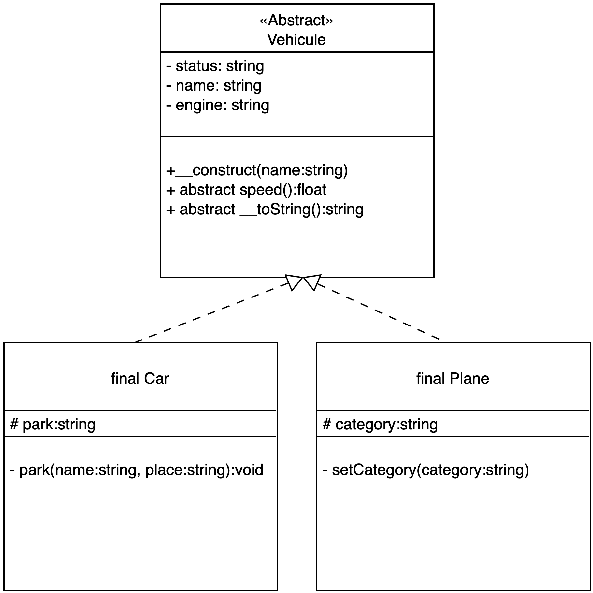
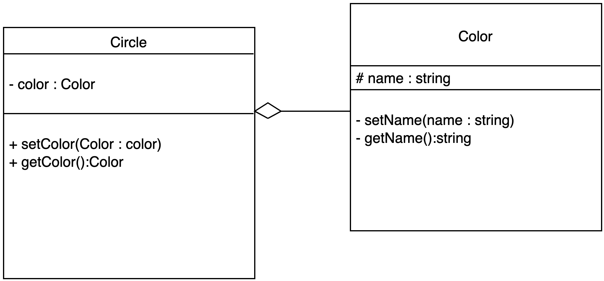
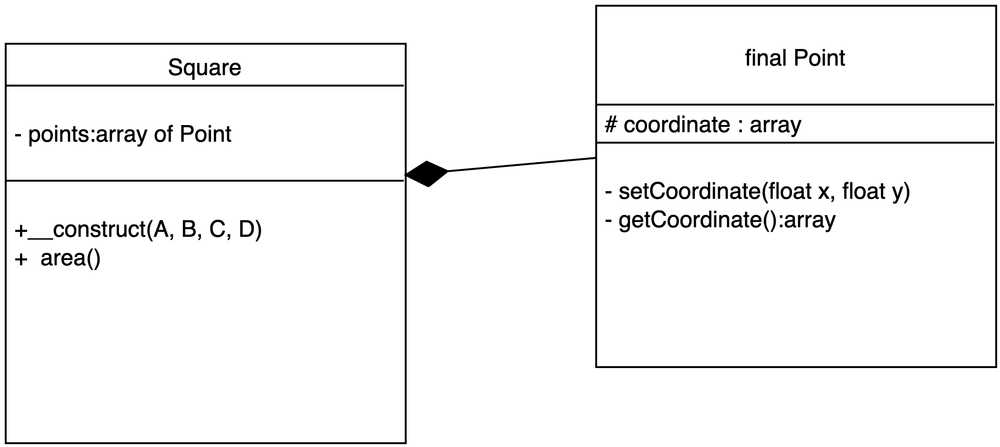

# Exercice : Héritage, Park de véhicules

Interprétez le diagramme de classe suivant, on vous rappelle les symboles utilisés dans ce dernier :

```text
- private
+ public
# protected

Flèche pointillée : héritage classe abstraite
```



Voici un cas d'utilisation des classes métiers à implémenter :

```php
require __DIR__ . '/vendor/autoload.php';

use Park\Car;
use Park\Plane;

// détermine la vitesse 
Car::setSpeed(180);

// $name 
$kia = new Car('Kia');
$kia->setEngine('electric');

$kia->park('Place de la liberté', 'place : 56A');
$kia->setStatus('stop');

// méthode magique permettant d'afficher les informations
echo  $kia . "\n";
// Name: Kia, Engine: electric, Status: stop, Park address: Place du chateau place: 56A

echo "\n";

// Plane
Plane::setSpeed(890);

// $name 
$plane = new Plane('Airbus A320');
$plane->setEngine('petrol');
$plane->setStatus('flight');

echo $plane . "\n";
```
# Exercice : Circle & Color

Soient la classe Circle et la classe Color. Un cercle possède une couleur (agrégation). En utilisant le diagramme de classe suivant créez un cercle rouge puis, un cercle bleu.



```php
spl_autoload_register(function ($class) {
    include __DIR__ .'/'.$class.'.php';
});

$circle = new Circle;
$red = new Color('red');
$blue= new Color('blue');

$circle->setColor($red);
echo $circle->getColor()->getName() . "\n"; 

$circle->setColor($blue);
echo $circle->getColor()->getName() . "\n";
```

# Exercice : ManageNews (association permanente)

Soient les classes Log et ManageNews. A chaque fois que l'on crée un objet de type ManageNews la méthode statique addLog de la classe Log notifie sa date de création (format d/m/y h:m:s) dans un tableau. 

Utilisez le diagramme suivant pour implémenter les classes :


```php
spl_autoload_register(function ($class) {
    include __DIR__ . '/' . $class . '.php';
});

$n1 = new ManageNews(new Log, "Article PHP");
$n2 = new ManageNews(new Log, "Article MySQL");
$n3 = new ManageNews(new Log, "Article JS");
$n4 = new ManageNews(new Log, "Article MongoDB");
$n5 = new ManageNews(new Log, "Article Python");

var_dump(Log::getStorage());
```


# Exercice : Square

1. Soient la classe Square et la classe Point. Créez un carré en définissant 4 points (0,0), (0,1), (1, 1), (0, 1) dans un repère à deux dimensions. Implémentez le code en suivant le diagramme suivant, la flèche pleine  relie la classe Point à Square. 

*Un carré est composé de 4 points (objet de type Point) exactement.*

2. La méthode area donnera l'aire du carré. 
*Calculez la longueur d'un côté : AB.*


        
```php
spl_autoload_register(function ($class) {
    include __DIR__ . '/' . $class . '.php';
});

$A = new Point(0, 0);
$B = new Point(1, 0);
$C = new Point(1, 1);
$D = new Point(0, 1);

$square = new Square($A, $B, $C, $D);

echo $square->area(); // 1 m2
```

# Exercice : Répondez aux questions suivantes

Analysez le code qui suit puis répondez aux questions suivantes :

1. Peut-on instancier une interface ?

2. Peut-on oublier certains paramètres des fonctions du contrat (comme price) lors de la définition de cette méthode dans la classe ?

3. La méthode add de la classe Shop type son paramètre. Qu'est ce que cela permet de faire de manière générale ?

```php
interface Productable{

const TVA = .2;

public function price():float;
public function setPrice(float $price):void;
}

class Book implements Productable{
    private $price;

    public function price():float{
        return $this->price * ( Productable::TVA + 1) ;
    }
    public function setPrice(float $price):void{
        $this->price = $price;
    }
}

class Shop {
    private $products = [];

    public function add( Productable $product ){
        $this->products[] = $product;
    }

    public function products(){
    
        foreach($this->products as $product)
            echo $product->getPrice() . "\n";
    }
}

$p1 = new Book();
$p1->setPrice(12);
$p2 = new Book();
$p2->setPrice(2.7);
$p3 = new Book();
$p3->setPrice(20.5);

$shoop = new Shoop();
$shoop->add($p1);
$shoop->add($p2);
$shoop->add($p3);

$shoop->products();
```

*Il existe de nombreuses interfaces pré-définies en PHP, nous les reverrons plus loin dans le cours.*

# Exercice : Parking (synthèse)

Créez un dossier Parking avec l'architecture de dossiers et fichiers suivante. Vous pouvez utiliser les classes Vehicule, Car et Plane de l'exercice Park précédent. Définissez un namespace Park de haut niveau (composer.json) :

```txt
Parking/
    src/
        Vehicule.php
        Car.php
        Plane.php
        Bike.php
        Parkable.php
    app.php
    composer.json
```

Vous suivrez le diagramme de classes suivant pour vous aidez à implémenter les classes :


1. Créez les classes **Bike**, **Car** et **Vehicule** puis, créez la classe **Parking**. Un objet de type "Bike" ou "Car" peut se garer dans un parking (objet de type Parking). Ces deux classes sont également de type Vehicule (héritage).

Définissez maintenant l'interface **Parkable** :

- Contrats :
    - park(address:string, place:string)
    - pay(price:float)

La classe Parking possèdera les méthodes suivantes :

- addPark : cette méthode permettra d'ajouter un Objet Parkable
- removePark : cette méthode permettra de "sortir" un Objet Parkable
- count : compte le nombre de mobile(s) garé(s)

*Vous pouvez si vous le souhaitez utiliser la classe SplObjectStorage (clé/valeur) pour enregistrer les objets dans le parking.*

Faites en sorte que seules les classes Bike et Car puissent se garer dans un Parking :

```php
require __DIR__ . '/vendor/autoload.php';

use Park\Car;
use Park\Plane;
use Park\Bike;
use Park\Parking;

Car::setSpeed(180);
Plane::setSpeed(890.5);

$brompton = new Bike('brompton');
$kia = new Car('kia');

$airbus = new Plane('airbus 320');

$parking = new Parking();
$parking->addPark($brompton);
$parking->addPark($kia);
try {
    $parking->addPark($airbus); // exception

} catch (TypeError $e) {
    echo $e->getMessage();
}

echo $parking . "\n";
```

4. Créez la classe Ferry. Elle possède un Parking, c'est également un objet de type Vehicule.

```php
$ferry= new Ferry($parking);

$telsa =new Car('tesla');
$parking->addPark($telsa);
echo $parking . "\n";

```

5. Implémentez une méthode getAll ou __toString dans la classe Parking. Cette méthode affichera le détail des objets qui sont garés dans un parking.


