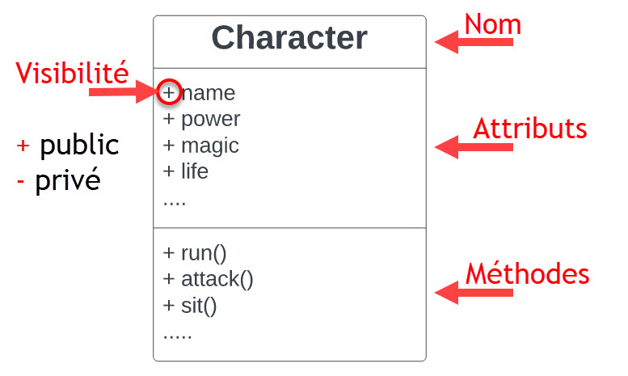
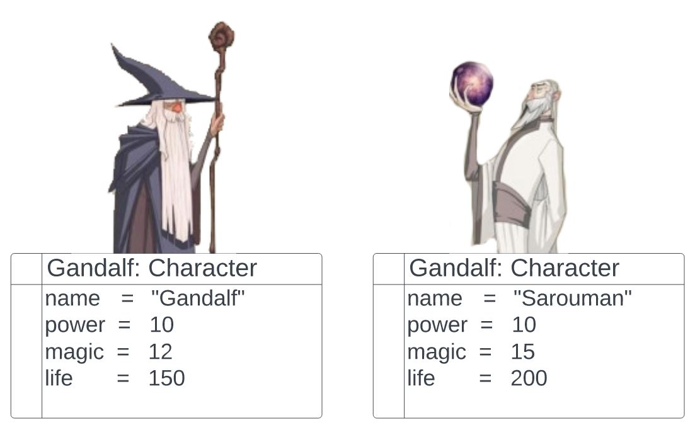
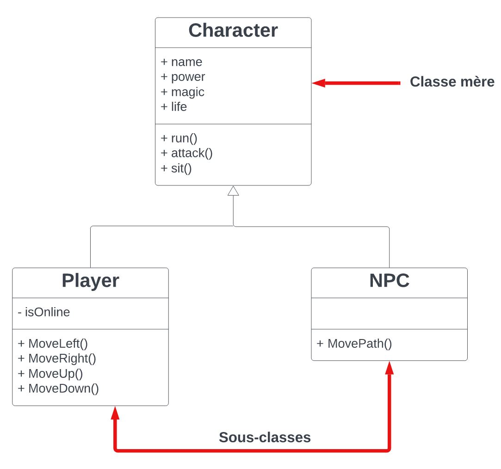
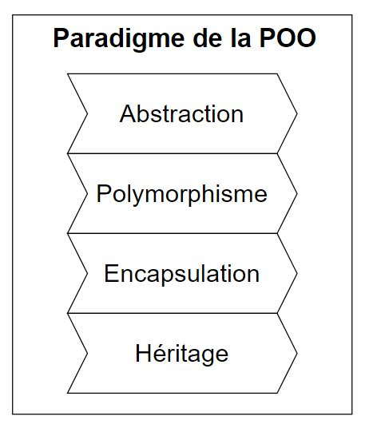
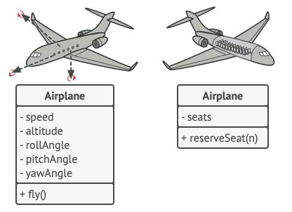
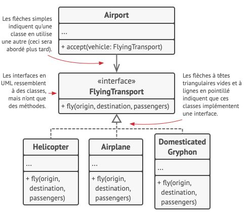
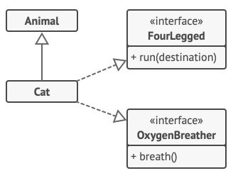
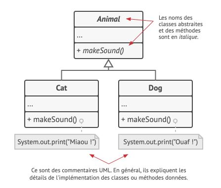

# Les bases de la POO.

La **P**ro­gram­ma­tion **O**rien­tée **O**bjet est un pa­ra­digme qui se base sur la re­pré­sen­ta­tion des don­nées et de leur com­por­te­ment dans des briques lo­gi­cielles ap­pe­lées **ob­jets**, qui sont fa­bri­qués à par­tir d’un en­semble de « plans » dé­fi­nis par un dé­ve­lop­peur, que l’on ap­pelle des **classes**.


## Objets, classes

Prenons l'exemple, d'un personnage de jeux vidéo. 



Supposons que nous avons un jeu d'aventure et que nous créons un personnage nommé Gandalf. Gandalf est un objet, une instance de la classe `Character`. Chaque `Character`  possède un nombre standard d'attributs: nom, énergie, magie, point de vie, etc. Ce sont les *attributs*(ou champs) de la classe. 

Les attributs d'une classe sont les variables d'une classe et les méthodes sont les fonctions de la classe. Plus généralement on appelle *membre* d'une classe les attributs ou méthodes d'une classe.

```php
class Character{
    private $name;
    private $power;
    private $magic;
    private $life;

    public function FireBall(){
        echo "FireBall!!";
    }
}
```
Un objet est une instance de classe, c'est une variable dans le script courant.

```php
$gandalf = new Character();
$sarouman = new Character();
```

Tous les personnages se comportent également de la même manière : ils courent, attaquent, se défendent,etc.



Sarouman, l'ennemie de Gandalf, est également une instance de la classe `Character`. Il possède les mêmes attributs que Gandalf. Mais le contenu de ses attributs différe de ceux de Gandalf : Les points de vie et la puissance magique. 

Une *classe* est donc un peu comme un plan qui définit la structure pour les *objets*. Les objets sont les instances concrètes de cette classe. 

## Visibilité d'un attribut ou d'une méthode

Si on souhaite afficher la valeur d'un attribut de la classe `Character`, dans le script courant, directement, sans avoir à utiliser une méthode public qui y a accès, il faudra modifier sa visibilité et la passer en `public` :

```php
class Character{
    public $name;
    private $power;
    private $magic;
    private $life;

    public function FireBall(){
        echo "FireBall!!";
    }
}

$gandalf = new Character();
echo $gandalf->name;
```

Dans le cas contraine, le champ `name` est privé et n'est accessible qu'au travers une méthode `public`. 

```php
class Character{
    private $name;
    private $power;
    private $magic;
    private $life;

    public function FireBall(){
        echo "FireBall!!";
    }
    public function getName(){
     return $this->name;
    }
}

$gandalf = new Character();
echo $gandalf->getName();
```
> **Note**
> Rappelons que le mot clef `$this`, permet d'accèder à des méthodes ou attributs de l'instance de l'objet. 
>  

## Hiérarchies de classes

Un vrai pro­gramme con­tient bien plus de classe. Cer­taines de ces classes peu­vent être or­ga­ni­sées dans une **hié­rar­chie de classes**. Voyons ce que cela signifie.

Dans notre jeu, nous allons intégrer des PNJs, Personnages Non Joueur comme des créatures. Il se trouve que les personnages que contrôleront les joueurs et les PNJs ont beaucoup de points communs : comme le nom, de la puissace, de la magie, et des points de vie qui sont des attributs.
Les PNJs marchent aussi, combattent, etc. Il semblerait donc que l'on peut définir une classe de base qui recense les attributs et comportements communs. 



Une classe pa­rent, comme celle que nous ve­nons juste de dé­fi­nir, est ap­pe­lée une **classe mère** (ou super-classe, ou en­core classe de base). Ses en­fants sont des **sous-classes** (ou classes dé­ri­vées). Les sous-classes hé­ri­tent de l’état et du com­por­te­ment de leur pa­rent et ne dé­fi­nis­sent que les at­tri­buts ou les com­por­te­ments qui dif­fè­rent. 

## Les piliers de la POO

La pro­gram­ma­tion orien­tée objet est basée sur quatre pi­liers : des con­cepts qui la dif­fé­ren­cient des autres pa­ra­digmes de la pro­gram­ma­tion.



### Abstraction

Lorsque vous créez un pro­gramme avec la POO, la ma­jeure par­tie du temps vous allez mo­dé­li­ser les ob­jets en les ba­sant sur des ob­jets du monde réel. Ce­pen­dant, les ob­jets de votre pro­gramme ne re­pré­sen­tent pas une copie de l’ori­gi­nal à 100 % (et on a ra­re­ment be­soin que ce soit le cas). Vos ob­jets ne font que mo­dé­li­ser les at­tri­buts et com­por­te­ments des ob­jets réels dans un con­texte spé­ci­fique, et ig­no­rent le reste.

Par exemple, une classe `Avion` pour­rait exis­ter dans un si­mu­la­teur de vol et dans l’ap­pli­ca­tion d’une com­pag­nie aé­rienne qui per­met de ré­ser­ver des places. 

Mais dans un simulateur, ce sont les don­nées qui con­cer­nent le vol en lui-même que l’on va uti­li­ser.
Dans l'application pour une compagnie aérienne, la classe va plu­tôt s’oc­cu­per des in­for­ma­tions con­cer­nant l’agen­ce­ment in­té­rieur et la dis­po­ni­bi­lité des places.



*L’abs­trac­tion* est la mo­dé­li­sa­tion d’un objet ou phé­no­mène du monde réel, li­mité à un con­texte spé­ci­fique dont on re­lève tous les dé­tails utiles avec une grande pré­ci­sion, et dont on ig­nore le reste.

### Encapsulation

Pour dé­mar­rer le mo­teur d’un avion, vous n’avez qu’à tour­ner une clé ou à ap­puyer sur un bou­ton. Vous n’avez pas be­soin de con­nec­ter les câbles, et d’amor­cer le cycle d’ali­men­ta­tion du mo­teur. Ces dé­tails sont cachés dans le fuselage. Vous avez une interface : le manche, la manette des gazes.
Cet exemple permet d'illustrer l'**interface** d'un objet, c'est à dire, la partie publique d'un objet qui est ouverte aux intéractions avec les autres objets. 

L'*encapsulation* est un mécanisme consistant à cacher les données et certaines implementations de l’objet et à avoir accès aux données que par les services proposés par l’objet (méthodes dites publiques.  

En­cap­su­ler quelque chose sig­ni­fie qu’on la rend `private`, et donc ac­ces­sible uni­que­ment aux mé­thodes de sa propre classe. Il existe un mode lé­gè­re­ment moins res­tric­tif que l’on ap­pelle `protected`, qui rend un membre ac­ces­sible aux sous-classes.

Les in­ter­faces et les classes/mé­thodes abs­traites de la ma­jo­rité des lan­gages de pro­gram­ma­tion sont ba­sées sur les con­cepts de l’abs­trac­tion et de l’en­cap­su­la­tion. En PHP, le mécanisme des interfaces (mot clé `interface`) vous per­met d’éta­blir des con­trats d’in­te­rac­tion entre les ob­jets. 

> **Note**
> C’est pour cette raison que les in­ter­faces ne se préoc­cu­pent que des com­por­te­ments des ob­jets, et que vous ne pou­vez pas dé­cla­rer un at­tri­but dedans.


Ima­gi­nez une in­ter­face `TransportAérien` dotée d’une mé­thode `voler(origine, destination, passagers)`. 

Lorsque vous con­ce­vez un si­mu­la­teur de trans­port aé­rien, vous pou­vez mettre une res­tric­tion sur la classe `Aéroport`, afin qu’elle ne puisse in­te­ra­gir qu’avec les ob­jets qui im­plé­men­tent l’in­ter­face `TransportAérien`. 

Grâce à cette con­fi­gu­ra­tion, vous pou­vez être cer­tain que n’im­porte quel objet passé à un objet aé­ro­port, que ce soit un `Avion`, un `Hélicoptère` pourra s’en­vo­ler ou at­ter­rir dans ce type d’aé­ro­port.



Vous pou­vez mo­di­fier l’im­plé­men­ta­tion de la mé­thode `voler` dans ces classes comme bon vous semble. Tant que la sig­na­ture de la mé­thode reste iden­tique à celle dé­cla­rée dans l’in­ter­face, toutes les ins­tances de la classe `Aéroport` peu­vent ma­ni­pu­ler vos ob­jets vo­lants sans problème.

```php
interface FlyingTransport
{
    public function fly($origin, $destination, $passengers);
}
```
```php
class Helicopter implements FlyingTransport
{
  
  // Helicopter parameters

    public function fly($origin, $destination, $passengers)
    {
       // Do Stuff
    }
  // Helicopter methos
}
```
```php
class Airplane implements FlyingTransport
{
  
  // Airplane parameters

    public function fly($origin, $destination, $passengers)
    {
       // Do Stuff
    }
  // Airplane methos
}
```
### Héritage

L’hé­ri­tage per­met de cons­truire de nou­velles classes à par­tir de classes exis­tantes. Il fa­vo­rise la réu­ti­li­sa­tion du code. 

Si vous vou­lez créer une classe qui est lé­gè­re­ment dif­fé­rente d’une classe exis­tante, vous n’avez pas be­soin de du­pli­quer votre code. 

À la place, vous pou­vez **étendre** la classe exis­tante dans une sous-classe qui hé­rite de ses at­tri­buts et mé­thodes et écrire dans cette sous-classe les fonc­tion­na­li­tés sup­plé­men­taires.

Les sous-classes qui uti­li­sent l’hé­ri­tage bé­né­fi­cient de la même in­ter­face que leur classe mère. Vous ne pou­vez pas ca­cher une mé­thode dans une sous-classe si elle a été dé­cla­rée dans la classe mère. Vous devez éga­le­ment im­plé­men­ter toutes les mé­thodes abs­traites dans vos sous-classes, **même si leur pré­sence y pa­rait illogique.**



En PHP, une sous-classe ne peut étendre qu'une seule classe mère mais peut implémenter autant d'interfaces en même temps qu'elle le veut. 
Si une classe mère implémente une interface, toutes ses sous-classes doivent également l'implémenter. 

```php
interface FourLegged
{
    public function run($destination);
}
```
```php
interface OxygenBreather
{
    public function breath();
}
```

```php
class Animal {
  // Animal class
}
```
```php
class Cat extends Animal implements FourLegged, OxygenBreather {
  // Cat class
}
```
### Polymorphisme

Re­gar­dons quelques exemples d’ani­maux. La ma­jo­rité des `Animaux` peut émettre des sons. Nous pou­vons donc an­ti­ci­per le fait que toutes les sous-classes vont de­voir re­dé­fi­nir la mé­thode de base `émettreSon` afin que chaque classe puisse émettre le son cor­res­pon­dant ; nous la dé­cla­rons donc im­mé­dia­te­ment `abs­tract`. 

Ceci nous per­met d’ig­no­rer toute im­plé­men­ta­tion par dé­faut de la mé­thode dans la classe mère, mais oblige les sous-classes à pos­sé­der leur propre version.



```php
abstract class Animal {
  // Animal class
  abstract public function makeSound();
}
```

```php
class Cat {
  // Cat class
   public function makeSound(){
    // a Cat sound
   }
}
```

```php
class Dog {
  // Dog class
   public function makeSound(){
    // a Dog sound
   }
}
```
Ima­gi­nez que vous met­tez plu­sieurs chats et chiens dans un grand sac. En­suite vous fer­mez les yeux, et sor­tez les ani­maux du sac un par un. Lorsque nous sor­tons un ani­mal du sac, nous ne pou­vons pas dire avec cer­ti­tude ce que c’est. Ce­pen­dant, si nous le câ­li­nons assez fort, l’ani­mal va émettre un cri de joie en fonc­tion de sa classe concrète.

```php
bag = [new Cat(), new Dog()];
foreach (Animal a : bag)
  a.makeSound()

// Miaou !
// Ouaf !
```

Le po­ly­mor­phisme est la ca­pa­cité d’un pro­gramme à dé­tec­ter la classe d’un objet et à ap­pe­ler son im­plé­men­ta­tion, même si son type est in­connu dans le con­texte actuel.

Vous pou­vez aussi voir le po­ly­mor­phisme comme la pos­si­bi­lité pour un objet de « pré­tendre » être autre chose (en gé­né­ral une classe qu’il étend, ou une in­ter­face qu’il im­plé­mente). Dans notre exemple, les chiens et chats du sac pré­ten­dent être des ani­maux génériques.

## Relations entre les objets

Nous avons abordé l'*héritage* et l'*implémentation* mais il existe d'autres types de relations entre les objets. 

### Dépendance


*Un professeur dépend de son cours.*

La *dépendance* est une relation basique. Si deux classes sont dépendantes alors les modifications apportées à la définition de l'une d'entre elles occasionnent des changements dans l'autre.

On créé une dépendance lorsque l'on utilise le nom de classes concrètes dans le code, comme par example lorsque l'on

* met des types dans les signatures des méthodes.
* instancie les objets dans le constructeur. 


### Association


*Un professeur communique avec ses élèves.*

L'*association* est une relation dans laquelle un objet utilise ou intéragit avec un autre objet. 

En representation UML, cette relation se représente par une flèche simple qui part depuis un objet vers l'objet utilisé. 
Lorsque la flèche est simple, on dit que la dépendance est simple. Mais il peut y avoir des doubles flèches dans la représentation pour symboliser le fait que les deux objets ont toujours accès à l'un ou l'autre. 

L'association est utilisée pour représenter un lien avec un attribut dans une classe par exemple.

Prenons un exemple pour bien comprendre la différence entre *dépendance* et *association*.

Prenons une classe : `Professor`

```php
class Professor {
  private Student $student;

  public function teach(Course c ) {
    this.student.achievement(c.finish())
  }
}
```

Jetons un oeil à la méthode `teach`. Elle attend en paramètre un objet de type `Course` qui sera utilisé ensuite dans son corps. 
Si la méthode `finish()` de la classe `Course` viendrait a être modifiée (modifier son nom, ajouter des paramètres obligatoires,etc), le code risque de lever une exception. C'est ce que l'on appelle une **dépendance**.

Maintenant, regardons l'attribut `student` et son utilisation dans la méthode `teach()`. 
On peut affirmer que la classe `student` est une dépendance de `Professor`. En effet, là aussi, si la méthode `achievement` est modifiée, alors une exception sera levée. 
Toutefois, l'attribut `student` est toujours accessible à n'importe quelle méthode de la classe `Professor`,de ce fait, la relation n'est plus seulement une dépendance mais une association. 

### Agrégation


Alors qu'une association simple décrit une relation entre deux objets seulement, l'*agrégation* quant à elle représente une relation entre "1 à plusieurs", "plusieurs à plusieurs" ou une relation "agrégat-agrégé" entre plusieurs objets. 

L'agrégation signifie "**contient**", "**est composé de**" et est une association forte, un objet A est une partie d'un objet B. 
Une  agrégation est le regroupement de plusieurs objets afin de construire un objet "complet" nommé **agrégat**.

Lorsque l'on souhaite modéliser une relation tout/partie où une classe constitue un élément plus grand (tout) composé d'éléments plus petits (partie), il faut utiliser une agrégation.

Dans notre schéma UML plus haut, nous avons une relation d'agrégation entre un professeur et des départements auquel il est rattaché. 
Car un département est constitué d'un ensemble de professeurs. 


> **Note**
> Un des objets qui compose l'agrégat peut être utilisé dans d'autres objets, on dit alors qu'il est **partageable**.
> 

Exemple : 

```php
class Departement {
  private Professor $professors = [];
}
```

La relation n'est pas symétrique, il n'est pas possible de dire qu'un `Departement` peut être composé de `Professor` et qu'un `Professor` peut être composé de `Departement`.

`Professor` est l'**agrégé**, c'est à dire un composant, d'une instance de `Departement`.

`Departement` est l'**agrégat**.
Un **agrégé** peut exister alors que l'**agrégat** n'existe pas. 


### Composition


La composition est une association **très forte**.
La relation est plus forte car le composant n'est pas partageable. Il ne peut être lié qu'à un seul composé. 

Lorsque le composé est détruit, ses composants le sont également. 

Dans notre exemple ci-dessus, nous avons une université qui est composée de départements. 
Les départements de l'université ne sont pas partagés avec d'autres établissements. Ils sont indissociables de l'université. 

Si l'université doit un jour fermer, se sont aussi ses départements qui disparaitront. 


