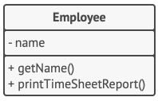
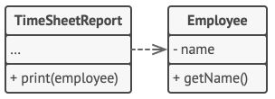

# Chap 2 : Single Responsability

> **Note**
> *Une classe ne de­vrait être mo­di­fiée que pour une seule raison.*

Es­sayez de faire en sorte qu’une classe ne soit res­pon­sable que d’une par­tie d’une fonc­tion­na­lité de votre lo­gi­ciel, et en­cap­su­lez cette res­pon­sa­bi­lité en­tiè­re­ment dans la classe.

L’ob­jec­tif prin­ci­pal de ce prin­cipe est de di­mi­nuer la **com­plexité**. 

Vous n’avez pas be­soin d’in­ven­ter un con­cept so­phis­ti­qué pour un pro­gramme doté d’en­vi­ron 200 lignes de code. 

Écri­vez une di­zaine de jo­lies mé­thodes et tout ira pour le mieux.

Les vrais pro­blèmes font sur­face avec l’évo­lu­tion et les mo­di­fi­ca­tions de votre pro­gramme. Au bout d’un mo­ment, cer­taines classes de­vien­dront tel­le­ment grosses que vous ne vous sou­vien­drez plus de leurs dé­tails. Na­vi­guer dans le code va de­ve­nir fas­ti­dieux et vous de­vrez par­cou­rir des classes en­tières ou même tout le pro­gramme pour trou­ver ce que vous cher­chez. Le nombre d’en­ti­tés dans le pro­gramme va com­plè­te­ment sub­mer­ger votre cer­veau, et vous sen­ti­rez que vous per­dez le con­trôle du code.

Mais ce n’est pas tout : si une classe s’oc­cupe de trop de choses à la fois, vous de­vrez la mo­di­fier à la moindre évo­lu­tion. Vous ris­quez ainsi de pro­vo­quer des bugs dans des fonc­tion­na­li­tés que vous ne vou­liez même pas modifier.

Si vous éprou­vez des dif­fi­cul­tés à vous con­cen­trer sur des as­pects spé­ci­fiques du pro­gramme, sou­ve­nez-vous du **prin­cipe de res­pon­sa­bi­lité unique** et vé­ri­fiez s’il est grand temps de dé­cou­per cer­taines classes en plu­sieurs parties.

> **Note**
> Si vous avez du mal à trouver un nom facile pour une classe ou une fonction, cela vous indique que vous violez ce principe. Si un élément accomplit de nombreuses choses différentes, il devient difficile de lui attribuer un nom. 
> 
> Si vous êtes tenté d’inclure le mot « and » (« et ») dans son nom, voilà un autre indicateur de non-respect du principe de responsabilité unique !

## Exemple

La classe `Employee` a plu­sieurs rai­sons d’être mo­di­fiée. La pre­mière est di­rec­te­ment liée à la fonc­tion prin­ci­pale de la classe : *gérer les don­nées des em­ployés*. Mais il y a une autre rai­son : le for­mat du rap­port des poin­tages est sus­cep­tible de chan­ger, ce qui vous de­mande de mo­di­fier le code de la classe.



Celle classe contient plusieurs comportements différents.

Ré­sol­vez le pro­blème en dé­pla­çant le com­por­te­ment con­cer­nant l’im­pres­sion des rap­ports des poin­tages dans une classe sé­pa­rée. Ce chan­ge­ment vous per­met de dé­pla­cer tout ce qui con­cerne les rap­ports dans cette nou­velle classe.



## Exercice 1 : `Lamp`

Soit une lampe, qui peut s'allumer et s'éteindre

```php
class Lamp {

  private $light = false;

  public function switch():void{
      $this->light = !$this->light;
  }

  public function getStatus(): string
  {
      if( $light ) return "On";
      
      return "Off";
  }
}
```

Déterminez deux classes ayant des responsabilités distinctes : `Light` (on/off), `Lamp` et mettez-les en relation.  

Dans cet exercice vous implémenterez une méthode `__toString` dans la classe `Lamp` pour connaître son état (`on` ou `off`). 

Voyez l'extrait de code ci-dessous qui montre comment utiliser les classes :

```php
// code ...
// $lamp est une instance de la classe Lamp
echo $lamp; // Off
$lamp->switch();
echo $lamp; // On
```

## Exercice 2: `Tools`

Voici une classe ayant trop de responsabilités. 

Refactorisez ce code pour que la classe `Tools` obéisse au principe : *Single Responsability*.

```php
class Tools
{
    private $format = 'd/m/y';
    private $max = 10;

    public function redirect($url)
    {
        header('Location: ' . $url);
        exit;
    }

    public function date($date)
    {
        return new Date($date)->format($this->format);
    }

    public function token(){

        return random_bytes($this->max);
    }
}

```

## Exercice 3: `User`

Soit la classe `User` :

```php
class User {
  
    private $email;
    
    // Getter and setter...
    
    public function store() {
        // Store attributes into a database...
    }
}
```

* Que dire de la méthode `store()` ?

* Proposez une modification du code pour que la classe `User` obéisse au principe de *Single Responsability*.

## Exercice 4: `Uploader`

Soit la classe `Uploader` qui permet de :

* Téléchager des fichiers.
* Redimensionner des images.
* Vérifier le type MIME des fichiers.
* Récupérer les extension des fichiers. 

Voici le code source : 
```php
class Uploader
{
    private $name;
    private $type;
    public $directory = '';
    public $validTypes = [];

    public function __construct($file)
    {
        $fileData = $_FILES[$file];
        $this->temporaryName = $fileData['tmp_name'];
        $this->name = $fileData['name'];
        $this->type = $fileData['type'];
        $this->validTypes = ['PNG', 'png', 'jpeg', 'jpg', 'JPG'];
    }

    public function uploadFile()
    {
        if (!in_array($this->type, $this->validTypes)) {
            $this->error = 'Le fichier ' . $this->name . ' n\'est pas d\'un type valide';

            return false;
        } else {
            return true;
        }
    }

    public function setName($name)
    {
        $this->name = $name;
    }

    public function getType()
    {
        return $this->type;
    }

    public function getName()
    {
        return $this->name;
    }

    public function getExtension()
    {
        return pathinfo($this->name, PATHINFO_EXTENSION);
    }

    public function resize($origin, $destination, $width, $maxHeight)
    {
        $type = $this->getExtension();
        $pngFamily = ['PNG', 'png'];
        $jpegFamily = ['jpeg', 'jpg', 'JPG'];
        if (in_array($type, $jpegFamily)) {
            $type = 'jpeg';
        } elseif (in_array($type, $pngFamily)) {
            $type = 'png';
        }
        $function = 'imagecreatefrom' . $type;

        if (!is_callable($function)) {
            return false;
        }

        $image = $function($origin);

        $imageWidth = \imagesx($image);
        if ($imageWidth < $width) {
            if (!copy($origin, $destination)) {
                throw new Exception("Impossible de copier le fichier {$origin} vers {$destination}");
            }
        } else {
            $imageHeight = \imagesy($image);
            $height = (int) (($width * $imageHeight) / $imageWidth);
            if ($height > $maxHeight) {
                $height = $maxHeight;
                $width = (int) (($height * $imageWidth) / $imageHeight);
            }
            $newImage = \imagecreatetruecolor($width, $height);

            if ($newImage !== false) {
                \imagecopyresampled($newImage, $image, 0, 0, 0, 0, $width, $height, $imageWidth, $imageHeight);

                $function = 'image' . $type;

                if (!is_callable($function)) {
                    return false;
                }

                $function($newImage, $destination);

                \imagedestroy($newImage);
                \imagedestroy($image);
            }
        }
    }
}
```

Actuellement, la classe s'utilise et se teste de la sorte : 

```php
require_once 'Uploader.php';

function it($m,$p){
    echo"\033[3",$p?'2m✔︎':'1m✘'.register_shutdown_function(function(){die(1);}),"$m\033[0m\n";
}

$_FILES['fichier.png'] = [
    'tmp_name' => './fichier.png',
    'name' => 'fichier.png',
    'type' => 'png',
];

$_FILES['mauvais_fichier.xls'] = [
    'tmp_name' => 'mauvais_fichier.xls',
    'name' => 'mauvais_fichier.xls',
    'type' => 'xls',
];

// CAS 1 : un bon fichier
$pngUploader = new Uploader('fichier.png');
it('Upload Fichier png', $pngUploader->uploadFile(sys_get_temp_dir()) == true);

// CAS 2 : un mauvais fichier
$excelUploader = new Uploader('mauvais_fichier.xls');

it('Upload Fichier excel', $excelUploader->uploadFile(sys_get_temp_dir()) == true);
var_dump($excelUploader->error);
```

* Créez les différentes classes qui permettront à la classe `Uploader` de répondre aux critères de *Single Responsability* .
* Recherchez dans le script de test de l'application les appels aux fonctions de la classe `Uploader` et remplacez-les par des appeles à vos nouvelles classes. 

## Exercice 5: `Book`

Voici la classe `Book`.  

```php
class Book
{
    public function getTitle()
    {
       return 'Clean Code';
     }
    
    public function getAuthor()
    {
        return 'Uncle Bob';
     }
    
    public function save($book)
    {
        return 'saving '. $book .'to local databse';
    }
  
}
```

Proposez une modification pour que la classe `Book` n'est une seule responsabilité. 