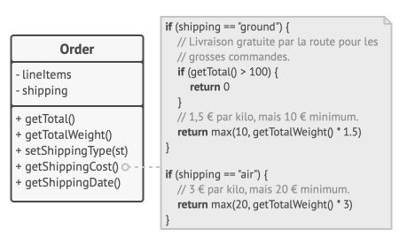

# Chap 3 : Open/Closed Principle

> **Principe**
>
> *Les classes doi­vent être ou­vertes à l’ex­ten­sion, mais fer­mées à la modification.*

L’idée prin­ci­pale de ce prin­cipe est d’évi­ter de créer des bugs dans du code exis­tant lorsque vous ajou­tez de nou­velles fonc­tion­na­li­tés.

Une classe est **ou­verte** si vous pou­vez l’étendre, créer une sous-classe ou faire n’im­porte quoi d’autre avec (ajou­ter de nou­veaux at­tri­buts ou mé­thodes, re­dé­fi­nir le com­por­te­ment de base, etc.).

Cer­tains lan­gages de pro­gram­ma­tion comme le PHP vous per­met­tent de li­mi­ter l’ex­ten­sion d’une classe à l’aide de mots-clés, comme `final`.
Avec ceci, la classe n’est plus ou­verte. Une classe est fer­mée (on peut éga­le­ment dire com­plète) si elle est prête à 100 % à être uti­li­sée par d’autres classes (son in­ter­face est clai­re­ment dé­fi­nie et ne sera plus mo­di­fiée dans le futur).

> **Note**
> Pour ce principe, une classe peut être à la fois ouverte à l'extention et fermée à la modification. 

Si une classe a déjà été dé­ve­lop­pée, tes­tée, va­li­dée et in­cluse dans un fra­me­work ou uti­li­sée dans une ap­pli­ca­tion, tou­cher au code peut être ris­qué. Plu­tôt que de mo­di­fier 

la classe di­rec­te­ment, vous pou­vez créer une sous-classe et re­dé­fi­nir les par­ties de classe ori­gi­nale dont vous vou­lez mo­di­fier le com­por­te­ment. Non seule­ment vous par­vien­drez au ré­sul­tat at­tendu, mais en plus vous ne cau­se­rez pas de pro­blème pour les clients exis­tants de la classe originale.

Ce prin­cipe n’est pas for­cé­ment va­lable pour toutes les rai­sons que vous pour­riez avoir de mo­di­fier une classe : si vous trou­vez un bug dans une classe, cor­ri­gez-le. Ne créez pas une sous-classe juste pour cela ! Une classe en­fant ne doit pas être res­pon­sable des pro­blèmes de ses parents.


> **Récapitulatif**
> * Une classe, une méthode doit pouvoir être étendue afin de pouvoir en modifier le comportement sans en changer directement le code (ou l'implémentation).
> * A cette fin,  nous utilisons le **polymorphisme** : l'*héritage* ou encore la *composition*.
> * En mettant en oeuvre cela, nous réappliquons en même temps le premier principe que nous avions abordé (1 classe = 1 responsabilité), avec un complément fonctionnel : 1 comportement nécessite sa propre classe, sa propre fonction, et les comportements doivent pouvoir être interchangés sans problème.
>  


## Exemple

Vous tra­vail­lez sur une ap­pli­ca­tion de bou­tique en ligne avec une classe `Order` qui cal­cule les coûts d’ex­pé­di­tion, et toutes les mé­thodes de ces coûts sont co­dées en dur dans la classe. Pour ajou­ter une nou­velle mé­thode d’ex­pé­di­tion, vous allez de­voir mo­di­fier la classe `Order` et vous ris­quez de pro­vo­quer des plantages.



Nous avons mo­di­fié la classe `Order` chaque fois que nous avons ajouté une mé­thode d’ex­pé­di­tion à l’ap­pli­ca­tion.


Pour résoudre ce problème, com­men­cons par ex­traire les mé­thodes d’ex­pé­di­tion et les mettre dans des classes sé­pa­rées qui im­plé­men­tent la même interface.


Maintenant, ajou­ter une nou­velle mé­thode d’ex­pé­di­tion ne vous oblige pas à ef­fec­tuer des mo­di­fi­ca­tions dans les classes existantes.

À pré­sent, si vous vou­lez im­plé­men­ter de nou­velles mé­thodes d’ex­pé­di­tion, vous pou­vez dé­ri­ver une nou­velle classe de l’in­ter­face `Shipping` sans avoir à tou­cher au code de la classe `Order`. Le code client de la classe `Order` as­so­ciera les com­mandes à un objet ex­pé­di­tion de la nou­velle classe lorsque l’uti­li­sa­teur choi­sit sa mé­thode d’ex­pé­di­tion dans l’in­ter­face.

> **Bonus** 
> En con­cor­dance avec le prin­cipe de res­pon­sa­bi­lité unique, cette so­lu­tion vous per­met de dé­pla­cer le cal­cul du délai de li­vrai­son dans des classes plus pertinentes.

## Exercice 1 :  `Bill`

La classe `Bill` devient incontrôlable et nous devons intervenir dessus.

1. Le gérant du restaurant vient de nous annoncer que désormais il va proposer aux clients des Panini pour 10€. Il faudra donc 
     * Créer une classe `Panini`.
     * Déclarer une méthode `Price` dans la classe `Panini` qui retournera la valeur 10.
2. Créer une `interface` contenant une méthode `pay` et s'assurer que tout les produits servis l'implémentent. 
3. Injecter l'interface dans la méthode `pay` de la class `Bill` et appeler la méthode `pay` de l'interface.

```php
class Bill {
    
    public function pay($item)
    {
        if ( is_a($item, 'Burger') )
        {
             $item->discount(5);
             return $item->price();
        }
        
        return $item->price();
    }
}
```

## Exercice 2 : Analyse

Nous allons analyser le code ci-dessous et déterminer ce qui pose problème au niveau de sa conception.

Voici deux classes `Product` et `Book`, cette dernière hérite de la classe `Product`. 
La classe `Book` surcharge la méthode `priceTTC()`.

```php
class Product
{
    public $price;
    public $name ;

    public function __construct(float $price, string $name)
    {
        $this->name = $name;
        $this->price = $price;
    }

    public function priceTTC(float $price, float $tva):float
    {
        return $price * (1 + $tva);
    }
}
```
```php
class Book extends Product
{
    public function priceTTC(float $price, float $tva, float $taxe):float
    {
         return $price * (1 + $tva) * $taxe;
    }
}
```

La classe `Cart` permet d'acheter des produits.

```php
class Cart
{
    private $total = 0;
    private $products = [] ;

    public function setProduct( Product $product){
        $this->products[] = $product;
    }

    public function total()
    {
        // calcul du prix total
        foreach($this->products as $product)
            $this->total += $product->priceTTC($product->getPrice(), .2);
    }
}
```

Répondez aux questions suivantes :

1. La classe Book est-elle conforme au principe SOLID ?
2. Que se passe-t-il si on ajoute des `Book` à la classe `Cart` et que l'on calcule le total des prix TTC ?
3. Quel principe doit-on appliquer pour coder correctement la classe `Book`, si on doit surcharger (re-définir) la méthode `priceTTC()` ?

## Exercice 3 : `Music`

Une application qui permet de lire des fichiers sons et de supporter les différents types de formats audio comme le **mp3** ou le **ogg**.

Mais les principes SOLID ne sont pas respectés et l'architecture logiciel présente quelques problèmes de conception qu'il faut maintenant corriger. 

Voici le code source de l'application : 

* Fichier : `Music.php`

```php
require_once 'Mp3.php';
require_once 'Ogg.php';

class Music
{
    private $filename;

    public function __construct($filename)
    {
        $this->filename = $filename;
    }

    public function listen()
    {
        $extension = pathinfo($this->filename, PATHINFO_EXTENSION);
        switch ($extension) {
            case 'mp3':
                $mp3 = new Mp3($this->filename);
                return $mp3->listen();
                break;
            case 'ogg':
                $ogg = new Ogg($this->filename);
                return $ogg->listen();
                break;
            default:
                throw new \Exception('Aucun lecteur trouvé pour cette musique');
        }
    }
}
```
* Fichier : `Mp3.php`
```php
class Mp3
{
    private $filename;

    public function __construct($filename)
    {
        $this->filename = $filename;
    }

    public function listen()
    {
        return 'Lecture du fichier Mp3 '. $this->filename;
    }
}
```
* Fichier : `Ogg.php`
```php
class Ogg
{
    private $filename;

    public function __construct($filename)
    {
        $this->filename = $filename;
    }

    public function listen()
    {
        return 'Lecture du fichier Ogg '. $this->filename;
    }
}
```

* Test de l'application : `app.php`

```php
require_once 'Music.php';

function it($m,$p){
    echo"\033[3",$p?'2m✔︎':'1m✘'.register_shutdown_function(function(){die(1);})," $m\033[0m\n";
}

$mp3File = 'rammstein.mp3';
$music = new Music($mp3File);

it('On écoute un fichier Mp3', $music->listen() === 'Lecture du fichier Mp3 rammstein.mp3');

$oggFile = 'wardruna.ogg';
$music = new Music($oggFile);

it('On écoute un fichier Ogg', $music->listen() === 'Lecture du fichier Ogg wardruna.ogg');
```

1. Améliorer le code des classes `Music` et `MP3` pour que le principe Open/Closed soit respecté. 

## [BONUS] Exercice 4 : `Programmer`

Une application permet de faire de la gestion de ressources humaines dans le secteur de l'IT. 

Nous avons une classe `ProjectManagement` qui permet de déterminer la nature du travail effectué par les différents corps de métier présent sur le projet. 
Exemple : Le programmeur, programme et le testeur, test... rien de plus compliqué. 

```php
class ProjectManagement
{
    public function process($member)
    {
        if ($member instanceof Programmer) {
            $member->code();
        } elseif ($member instanceof Tester) {
            $member->test();
        };

        throw new Exception('Invalid input member');
    }
}
```

voici les classes `Programmer` et `Tester` :
```php
class Programmer
{
    public function code()
    {
        return 'coding';
    }
}

class Tester
{
    public function test()
    {
        return 'testing';
    }
}
```

1. En reprenant la même architecture, ajouter 2 classes métiers :
   *  `AdminDb`,  dont le métier est de '*Managing DB*'. 
   *  `AdminSys`, dont le métier est de '*Managing Systems*'
2. Critiquez cette architecture au regard des principes SOLID

2. Proposez une modification SOLID.

