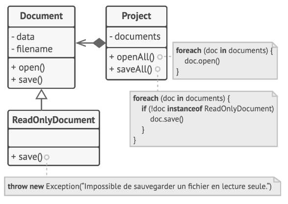
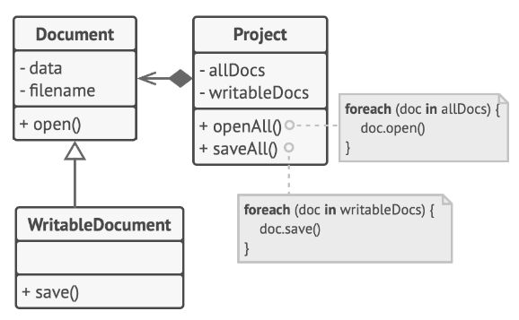

# Chap 4 : Liskov Substitution Principle

> **Principe**
>
> *Lorsque vous éten­dez une classe, rap­pe­lez-vous que vous devez être en me­sure de pas­ser des ob­jets de la sous-classe à la place des ob­jets de la classe mère sans faire plan­ter le code.*

Cela sig­ni­fie que les sous-classes res­tent com­pa­tibles avec le com­por­te­ment de la classe mère. Lorsque vous re­dé­fi­nis­sez une mé­thode, éten­dez le com­por­te­ment de base plu­tôt que de le rem­pla­cer com­plè­te­ment avec autre chose.

Le **prin­cipe de subs­ti­tu­tion** est un en­semble de vé­ri­fi­ca­tions qui aide à pré­dire si une classe va res­ter com­pa­tible avec du code qui fonc­tion­nait au­pa­ra­vant avec les ob­jets de la classe mère. 

Ce con­cept est **cri­tique** lorsque vous dé­ve­lop­pez des **li­brai­ries** et des **fra­me­works** parce que vos classes vont être uti­li­sées par d’autres per­sonnes, et vous ne pour­rez pas ac­cé­der di­rec­te­ment à leur code, ni le modifier.

Con­trai­re­ment aux autres prin­cipes de con­cep­tion qui sont ou­verts à l’in­ter­pré­ta­tion, le prin­cipe de subs­ti­tu­tion im­pose des pré­re­quis aux sous-classes, et plus spé­ci­fi­que­ment à leurs mé­thodes. 

**Re­gar­dons cette liste en détail.**

* **Les types des pa­ra­mètres de la mé­thode d’une sous-classe doi­vent *cor­res­pondre* ou être *plus abs­traits* que les types des pa­ra­mètres dans la mé­thode de la classe mère.**

  * Pre­nons une classe avec une mé­thode qui nour­rit les chats : `feed(Cat $cat)`. La méthode reçoit toujours en argument un objet `Cat`.

  * **BONNE PRATIQUE** : Pre­nons l’hy­po­thèse où vous avez créé une sous-classe qui a re­dé­fini la mé­thode pour nour­rir n’im­porte quel type d’ani­mal (une classe mère de chat) `feed(Animal $cat)`. Si vous pas­sez un objet de la sous-classe à la place d’un objet de la classe mère au code client, tout de­vrait se pas­ser pour le mieux. La mé­thode peut nour­rir tous les ani­maux, et elle peut aussi nour­rir les chats pas­sés par le client.

  * **MAUVAISE PRATIQUE** : Vous avez créé une autre sous-classe et li­mité la mé­thode pour qu’elle ne nour­risse que les chats du Ben­gal (une sous-classe de `Cat`). `feed(BengalCat $cat)`.  
  Que va-t-il ar­ri­ver à l'application si vous utilisez ce genre d’objet ultra spécialité ?   
  Puisque cette mé­thode ne peut nour­rir qu’une race spé­ci­fique de chats, elle ne pren­dra pas en charge les chats gé­né­riques pas­sés par le client, fai­sant plan­ter la fonc­tion­na­lité.


* **Le type de re­tour dans une mé­thode d’une sous-classe doit cor­res­pondre ou être un sous-type du type de re­tour de la mé­thode de la classe mère.** Comme vous pou­vez le cons­ta­ter, les pré­re­quis pour les types de re­tour d’une mé­thode sont l’in­verse des types des paramètres.

  * Soit une classe avec une mé­thode `BuyCat(): Cat`. L'application s’at­tend à re­ce­voir n’im­porte quel chat lorsqu’elle ap­pelle cette méthode.
  * **BONNE PRATIQUE** : Une sous-classe re­dé­fi­nit la mé­thode : `BuyCat(): BengalCat`. Le client ré­cu­père un chat du Ben­gal, qui est un chat, donc tout va bien.
  * **MAUVAISE PRATIQUE** : Une sous-classe re­dé­fi­nit la mé­thode :`BuyCat(): Animal`. À pré­sent l'application léve une exception puisqu’elle re­çoit un ani­mal gé­né­rique in­connu (un al­li­ga­tor ? Un ours ?) qui ne rentre pas dans la struc­ture con­çue pour un chat.

* **Une mé­thode dans une sous-classe ne de­vrait pas lever les types d’ex­cep­tions que la mé­thode de base n’est pas cen­sée lever.**
Les types d’ex­cep­tions doi­vent cor­res­pondre à ceux que la mé­thode de base est déjà ca­pable de lever ou en être des sous-types. 
Cette règle vient du fait que les blocs `try-catch` de l'application ciblent les types spé­ci­fiques d’ex­cep­tions que la mé­thode de base est sus­cep­tible de lever.
  * **Une sous-classe ne de­vrait pas ren­for­cer des pré­con­di­tions.**
  Pre­nons une mé­thode de base qui a un pa­ra­mètre de type `int`. Si une sous-classe re­dé­fi­nit cette mé­thode et de­mande que la va­leur du pa­ra­mètre passé à la mé­thode soit **po­si­tive** (*en le­vant une ex­cep­tion si la va­leur est né­ga­tive*), cela ren­force les pré­con­di­tions. L'application fonc­tion­nait très bien lorsqu’elle pas­sait des nombres né­ga­tifs à la mé­thode, mais main­te­nant elle plante si on lui donne un objet de cette sous-classe.

  * **Une sous-classe ne de­vrait pas af­fai­blir des post­con­di­tions.** Pre­nons une classe avec une mé­thode qui fonc­tionne avec une base de don­nées. Une mé­thode de cette classe est cen­sée tou­jours fer­mer les con­nexions ou­vertes à la base de don­nées lorsqu’elle ren­voie une valeur.

      **Exemple :** Vous avez créé une sous-classe et l’avez mo­di­fiée afin qu’elle laisse les con­nexions ou­vertes pour pou­voir les réu­ti­li­ser, mais le client n’a pro­ba­ble­ment au­cune idée de vos in­ten­tions. Il s’at­tend à ce que toutes les mé­thodes fer­ment les con­nexions, alors il pour­rait très bien dé­ci­der de fer­mer le pro­gramme juste après avoir ap­pelé la mé­thode, pol­luant le sys­tème avec une con­nexion fan­tôme à la base de données.
  
  * **Les in­va­riants d’une classe mère doi­vent être pré­ser­vés.** C’est pro­ba­ble­ment la règle la moins for­ma­li­sée de toutes. Les in­va­riants sont des con­di­tions qui per­met­tent de don­ner tout son sens à un objet. Par exemple, les in­va­riants d’un chat sont qu’ils ont quatre pattes, une queue, la pos­si­bi­lité de miau­ler, etc. Ce qui n’est pas très clair avec les in­va­riants, c’est qu’ils peu­vent être dé­fi­nis ex­pli­ci­te­ment sous la forme de con­trats avec l’in­ter­face ou d’un en­semble d’as­ser­tions à l’in­té­rieur des mé­thodes, mais ils peu­vent aussi être sous-en­ten­dus via cer­tains tests uni­taires ou via les ca­rac­té­ris­tiques pré­su­mées ou an­ti­ci­pées par l'application.

    La règle sur les in­va­riants est la plus fa­cile à en­freindre, car vous pour­riez omettre cer­tains des in­va­riants d’une classe com­plexe ou mal les com­prendre. Par con­sé­quent, la ma­nière la plus sé­cu­ri­sée d’étendre une classe est de créer de nou­veaux at­tri­buts et mé­thodes, et de ne pas tou­cher aux membres exis­tants de sa classe mère. Bien sûr, ce n’est pas tou­jours réa­li­sable dans la vraie vie.

* **Une sous-classe ne doit ja­mais mo­di­fier les va­leurs des at­tri­buts pri­vés d’une classe mère.** Quoi ? Com­ment se­rait-ce pos­sible ? Il se trouve que cer­tains lan­gages de pro­gram­ma­tion vous lais­sent ac­cé­der aux membres pri­vés d’une classe à l’aide de mé­ca­nismes de ré­flexion. D’autres lan­gages (Py­thon, Ja­vaS­cript) ne pro­tè­gent pas du tout les membres privés.


## Exemple

Voici une hiérarchie de classes de documents qui enfraignent le principe de substitution.



*Cela n’a aucun sens de vou­loir sau­ve­gar­der un do­cu­ment en lec­ture seule, la sous-classe tente donc de ré­soudre cette si­tua­tion en réi­ni­tia­li­sant le com­por­te­ment de base de la mé­thode redéfinie.*

La mé­thode `save()` de la sous-classe `ReadOnlyDocument` lève une ex­cep­tion si elle est ap­pe­lée. 
La mé­thode de base ne pos­sède pas cette res­tric­tion. Cela sig­ni­fie que l'application va plan­ter si nous ne vé­ri­fions pas le type du do­cu­ment avant de le sauvegarder.

Ce code en­freint le prin­cipe **Open/Closed**, car l'application de­vient dé­pen­dante des classes con­crètes des do­cu­ments. Si vous vou­lez in­tro­duire une nou­velle sous-classe de do­cu­ments, vous devez mo­di­fier l'application pour la prendre en charge.



*Le pro­blème est ré­solu en fai­sant de la classe do­cu­men­tEn­Lec­tu­re­Seule, la classe de base de la hiérarchie.*

Vous pou­vez ré­soudre ce pro­blème en re­pen­sant la con­cep­tion de la hié­rar­chie de classes : une sous-classe peut étendre le com­por­te­ment d’une classe mère. 

Le do­cu­ment en lec­ture seule de­vient donc la classe de base de la hié­rar­chie.

 Le do­cu­ment ou­vert en écri­ture est main­te­nant une sous-classe qui étend la classe de base et ajoute le com­por­te­ment de sauvegarde.

## Exercice 1 : `Candidate`

Nous avons une classe `User` de base. Nos classes `Employee` et `Candidate` sont des soustypes ou étendent la classe `User`.

Maintenant, imaginons que la méthode `UserSettings` soit appelée quelque part dans notre application afin d'afficher les paramètres d'un utilisateur. Cette méthode s'attend à recevoir en argument un objet sous-type de la classe `User`.

Le code suivant ne respecte pas le principe de substitution de Liskov. 

Fixez le problème. 

```php
// Base User class
abstract class User 
{
    protected $name;

     abstract public function getSettings();
    
 }
```

```php
 // Candidate
 class Candidate extends User
 {
     protected $settings=[];
     
     public function __constructs(arrray $settings)
     {
         $this->settings = $settings;
     }
     
     public function getSettings()
     {
         return $this->settings;
     }
 }
```

```php
 // Employee
 class Employee extends User
 {
     protected $settings=[];
     
     public function __constructs(arrray $settings)
     {
         $this->settings = $settings;
     }
     
     public function getSettings()
     {
         return (object) $this->settings;
     }
 }
```

```php
 class UserSettings
 {
     protected $user;
     
     public function __construct(User $user)
     {
         $this->user = $user;
     }
     
     public function output()
     {
         return $this->user->getSettings();
     }
 }
```

## Exercice 2 : `Analyse`

Nous allons analyser le code ci-dessous et déterminer ce qui pose problème au niveau de sa conception.

Voici deux classes `Product` et `Book`, cette dernière hérite de la classe `Product`. La classe `Book` surcharge la méthode `priceTTC()`.

```php
class Product
{
    public $price;
    public $name ;

    public function __construct(float $price, string $name)
    {
        $this->name = $name;
        $this->price = $price;
    }

    public function priceTTC(float $price, float $tva):float
    {
        return $price * (1 + $tva);
    }
}
```
```php
class Book extends Product
{
    public function priceTTC(float $price, float $tva, float $taxe):float
    {
         return $price * (1 + $tva) * $taxe;
    }
}
```

La classe `Cart` permet d'acheter des produits.

```php
class Cart
{
    private $total = 0;
    private $products = [] ;

    public function setProduct( Product $product){
        $this->products[] = $product;
    }

    public function total()
    {
        // calcul du prix total
        foreach($this->products as $product)
            $this->total += $product->priceTTC($product->getPrice(), .2);
    }
}
```

**Répondez aux questions suivantes :**

1. La classe `Book` est-elle conforme au principe **SOLID** ?
2. Que se passe-t-il si on ajoute des `Book` à la classe `Cart` et que l'on calcule le total des prix TTC ?
3. Quel principe doit-on appliquer pour coder correctement la classe `Book`, si on doit surcharger (re-définir) la méthode `priceTTC()`?

## Exercice 3 : `Music`

Rappelez vous de l'application de lecteur de musique ! 

1. Créer des interfaces pour les classes `MP3` et `WAV`. 

2. Créer une classe  `InvalidFileException` qui étendra la classe `Exception` afin de pouvoir 'attraper' les exceptions levées. 
    * Créer une classe `InvalidExtensionException` qui étendra la classe `InvalidFileException`. En cas de mauvais type de fichier envoyé au lecteur, il faudra lever une exception de type `InvalidExtensionException`.

    * Créer une classe `UnknownExtensionException` qui étendra la classe `InvalidFileException`. Si l'on essaie de lire un fichier sans aucune extension, il faudra lever une exception de type  `UnknownExtensionException`.

3. Créer un fichier `App.php` pour tester votre application et les exceptions gérées


* Fichier `Music.php`
```php
class Music
{
    private $musicType;

    public function __construct(MusicType $musicType)
    {
        $this->musicType = $musicType;

        $extension = pathinfo($this->musicType->getFilename(), PATHINFO_EXTENSION);
        
        if (empty($extension)) {
            throw new Exception('Les fichiers sans extension ne sont pas acceptés.');
        }
    }

    public function listen()
    {
        return $this->musicType->listen();
    }
}
```

* Fichier `MusicType.php`

```php
abstract class MusicType
{
    protected $filename;

    public function __construct($filename)
    {
        $this->filename = $filename;
    }

    public function getFilename() : string
    {
        return $this->filename;
    }

    abstract public function listen();
}
```

* Fichier `Mp3.php`

```php
require_once 'MusicType.php';

class Mp3 extends MusicType
{
    public function listen()
    {
        $extension = pathinfo($this->filename, PATHINFO_EXTENSION);
        if ($extension !== 'mp3') {
            throw new Exception("Fichier Mp3 attendu mais ''$extension'' obtenu");
        }

        return 'Lecture du fichier Mp3 '. $this->filename;
    }
}
```

* Fichier `Mp3.php`

```php
require_once 'MusicType.php';

class Wav extends MusicType
{
    public function listen()
    {
        $extension = pathinfo($this->filename, PATHINFO_EXTENSION);
        if ($extension !== 'wav') {
            throw new Exception("Fichier Wav attendu mais ''$extension'' obtenu");
        }

        return 'Lecture du fichier Wav '. $this->filename;
    }
}
```