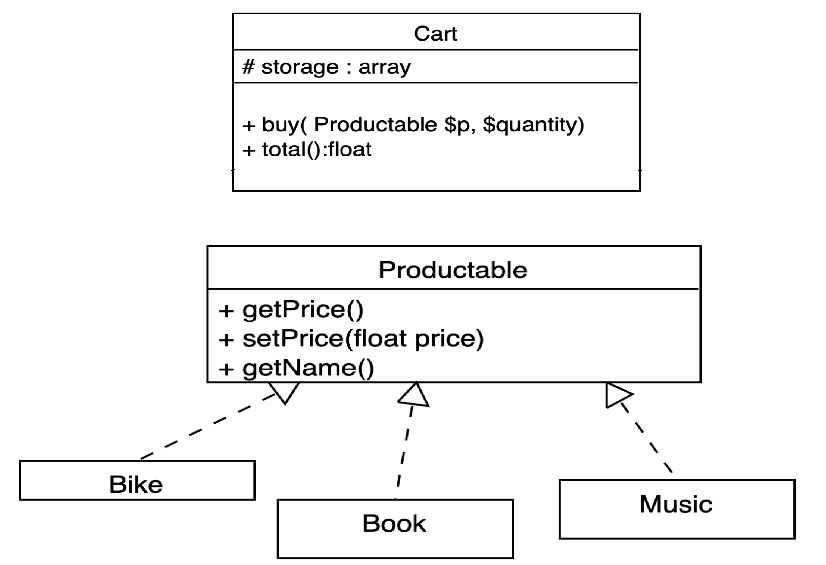

# Chap 5 : Interface Segregation

> **Principe**
>
>*Les clients ne de­vraient pas être for­cés à dé­pendre de mé­thodes qu’ils n’uti­li­sent pas.*

Selon le prin­cipe de sé­gré­ga­tion des in­ter­faces, vous de­vriez dé­cou­per vos « grosses » in­ter­faces pour les rendre plus pré­cises et spé­ci­fiques. 

Les clients ne doi­vent im­plé­men­ter que les mé­thodes dont ils ont vrai­ment be­soin. Sinon, une mo­di­fi­ca­tion ap­por­tée dans une « grosse » in­ter­face va même faire plan­ter les clients qui n’uti­li­sent pas les mé­thodes modifiées.

L’hé­ri­tage per­met à une classe de n’avoir qu’une seule classe mère, mais 

elle ne li­mite pas le nombre d’in­ter­faces qu’une même classe peut im­plé­men­ter en même temps. Il n’y a donc nul be­soin d’en­tas­ser des tonnes de mé­thodes qui n’ont aucun rap­port dans une même in­ter­face. Dé­cou­pez-les en plu­sieurs in­ter­faces plus spé­ci­fiques : une classe pourra toutes les im­plé­men­ter si be­soin, mais cer­taines classes se por­te­ront très bien avec une seule interface.

## Exemple

Prenons le cas d'une application de bi­blio­thèque utilisant des services de fournisseurs de Cloud.
Initialement, l'application ne prennait en compte que le Cloud Amazon (services et fonctionnalités)

Puis, lorsque l'on s'est at­ta­qués à la prise en charge des autres four­nis­seurs, il est devenu évident que les in­ter­faces de la bi­blio­thèque étaient bien trop larges. En effet, Amazon, Apple ou Google, utilisent des fonctionnalités totalement différentes. 
Cer­taines mé­thodes dé­cri­vent des services que les autres four­nis­seurs ne pro­po­sent pas.


*Tous les clients ne rem­plis­sent pas les pré­re­quis de cette énorme interface.*

Il est possible d'im­plé­men­ter ces mé­thodes et de ne pas coder leur comportement, mais ce n'est pas une solution élégante. 

La meil­leure ap­proche se­rait de dé­cou­per cette in­ter­face en plu­sieurs mor­ceaux. Les classes qui im­plé­men­taient l’in­ter­face ori­gi­nale peu­vent do­ré­na­vant im­plé­men­ter plu­sieurs in­ter­faces plus spé­ci­fiques. Les autres classes peu­vent im­plé­men­ter seule­ment les in­ter­faces do­tées des mé­thodes qui les intéressent.


*Une in­ter­face géante est dé­cou­pée en pe­tites in­ter­faces plus spécifiques.*

> **Attention !**
>
>Comme pour les autres prin­cipes, le risque est d’aller trop loin. Ne di­vi­sez pas une in­ter­face qui est déjà très spé­ci­fique. Rap­pe­lez-vous que plus vous créez d’in­ter­faces, plus votre code de­vient com­plexe. 
>
>Gar­dez un cer­tain équilibre.

## Exercice 1 : `Cart`

Soit une classe `Cart`. On aimerait pouvoir ajouter dans cette classe des produits différents : `Book`, `Music`, `Bike`,... Sans avoir d'erreurs. 

Implémentez une interface `Productable` et utilisez-la comme type dans l'injection des produits dans la méthode `buy()`.

Aidez vous du diagramme de classe et du code ci-dessous :



```php

spl_autoload_register(function ($class) {
    include __DIR__ .'/'.$class.'.php';
});

$products = [
    new Book('Moby Dick', 30),
    new Music('AC/DC', 17.5),
    new Bike('Brompton', 1430),
];

$cart = new Cart;

foreach($products as $product)
    $cart->buy($product, 5);

echo  $cart->total()  . "\n";
```

## Exercice 2 : `Workable`

Nous avons une interface `Workable` avec dedans les méthodes : `eat()`, `sleep()` and `work()`.

La classe `Human` implémente cette interface, ce qui veut dire qu'il faudra qu'elle définisse toutes ces méthodes, ce qui a du sens. 

Nous avons aussi une classe `Android`, qui peut travailler, mais qui ne dort pas et qui ne mange pas non plus. 

Nous ne respectons donc pas le principe de Ségrégation d'Interface. 

1. Réécrire le programme afin de répondre à ce principe. 

```php
interface Workable
{
    public function sleep();
    public function eat();
    public function work();
}
```
```php
class Human implements Workable
{
    public function sleep()
    {
        return true;
    }
    
    public function eat()
    {
        return true;
    }
    public function work()
    {
        return true;
     }
}
```
```php
class Android implements Workable
{
    public function sleep()
    {
        return false;
    }
    
    public function eat()
    {
        return false;
    }
    
    public function work()
    {
        return true;
     }
}

```