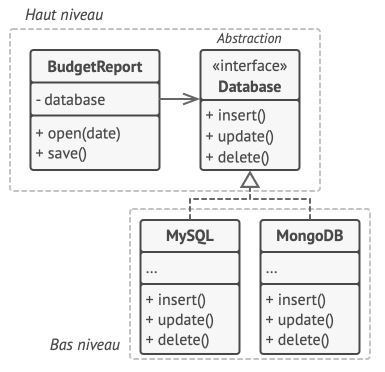

# Depen­dency In­ver­sion Prin­ciple

> **Principe**
>
>*Les classes de haut ni­veau ne de­vraient pas dé­pendre des classes de bas ni­veau. Elles de­vraient dé­pendre toutes les deux d’abs­trac­tions. Une abs­trac­tion ne doit pas dé­pendre des dé­tails. Les dé­tails doi­vent dé­pendre de l’abs­trac­tion.*

Lorsque l'on conçoit une application, on peut faire la dis­tinc­tion entre deux ni­veaux de classes:

* Les **classes de bas ni­veau** im­plé­men­tent des trai­te­ments ba­siques comme trans­fé­rer des don­nées sur un ré­seau, se con­nec­ter à une base de don­nées, etc.

* Les **classes de haut ni­veau** con­tien­nent la lo­gique mé­tier qui in­dique aux classes de bas ni­veau ce qu’elles doi­vent faire.

Naturellement, nous avons tendance à concevoir les classes de bas niveau afin de les exploiter dans celles de haut niveau. 
Cela est courant lorsque l'on dé­ve­lop­pe le pro­to­type d’une nouvelle application car nous n'avons qu'une vague idée de ce que l'on va pou­voir faire à haut ni­veau, car le code de bas ni­veau n’est pas très clair ou pas en­core im­plé­menté.

Avec une telle ap­proche, les classes de la lo­gique mé­tier ont ten­dance à de­ve­nir dé­pen­dantes des classes pri­mi­tives de bas niveau.

Le prin­cipe d’in­ver­sion des dé­pen­dances pro­pose de chan­ger le sens de cette dépendance.

1. Pour com­men­cer, vous devez **dé­crire les in­ter­faces pour les trai­te­ments** de bas ni­veau dont les classes de haut ni­veau vont avoir be­soin, de pré­fé­rence en uti­li­sant les termes de la lo­gique mé­tier. 

Par exemple, imaginons une application qui doit lire un fichier de rapport. 
La lo­gique mé­tier **doit** ap­pe­ler une mé­thode `ouvrirRapport(fichier)` plu­tôt qu’une suite de mé­thodes `ouvrirFichier(x)`, `lireOctets(n)`, `fermerFichier(x)`. 

**Ces in­ter­faces font par­tie du haut niveau.**

2. Main­te­nant, vous pou­vez rendre les classes de haut ni­veau dé­pen­dantes de ces in­ter­faces, plu­tôt que de les rendre dé­pen­dantes des classes con­crètes de bas ni­veau. Cette dé­pen­dance sera bien plus faible que celle d’ori­gine.

3. Une fois que les classes de bas ni­veau im­plé­men­tent ces in­ter­faces, elles de­vien­nent dé­pen­dantes de la lo­gique mé­tier, in­ver­sant la di­rec­tion de la dé­pen­dance originale.

Le prin­cipe d’in­ver­sion des dé­pen­dances est sou­vent uti­lisé en cor­ré­la­tion avec le prin­cipe **Open/Closed** : vous pou­vez étendre les classes de bas ni­veau pour uti­li­ser dif­fé­rentes classes de la lo­gique mé­tier sans avoir à mo­di­fier les classes existantes.

## Exemple

Dans cet exemple, la classe de haut ni­veau `BudgetReport`, qui éta­blit les rap­ports du bud­get uti­lise une classe de base de don­nées de bas ni­veau `MySQLDatabase` pour lire et écrire ses don­nées. Ce qui sig­ni­fie que la mo­di­fi­ca­tion de la classe `MySQLDatabase`  - *par exemple la li­vrai­son d’une nou­velle ver­sion du ser­veur de la base de don­nées* - va im­pac­ter la classe de haut ni­veau, qui n’est pas cen­sée s’oc­cu­per des dé­tails du sto­ckage des données.


*Une classe de haut ni­veau dé­pend d’une classe de bas niveau.*

On peut ré­gler ce pro­blème en créant une in­ter­face qui dé­crit les trai­te­ments de **lec­ture/écri­ture** et faire en sorte que la classe `BudgetReport` uti­lise l’in­ter­face plu­tôt que la classe de bas niveau `MySQLDatabase`. 

Vous pou­vez en­suite mo­di­fier ou étendre la classe de bas ni­veau ori­gi­nale et la faire im­plé­men­ter la nou­velle in­ter­face de lec­ture/écri­ture dé­cla­rée par la lo­gique métier.



*Les classes de bas ni­veau dé­pen­dent d’une abs­trac­tion de haut niveau.*

Par con­sé­quent, la di­rec­tion de la dé­pen­dance ori­gi­nale a été in­ver­sée : les classes de bas ni­veau sont main­te­nant dé­pen­dantes des abs­trac­tions de haut niveau.

## Exercice 1 : `Article`

Vous souhaitez changer de système de base de données et d'abandonner MySql pour MongoDb. 
Actuellement, nous savons que si nous effectuons le changement, l'application risque de ne plus fonctionner. 

Effectuez les changements nécessaire pour que le changement de SGDB soit transparent. 

```php
class Article {
    
    public function all()
    {
        return 'Returning all articles from local database';
    }
}
```

```php
class Display {
    
    protected $article;
    
    public function __construct(Article $article)
    {
        $this->article = $article;
    }
    
    public function articles()
    {
        return $this->article->all();
    }
}
```
## Exercice 2 : `Article`